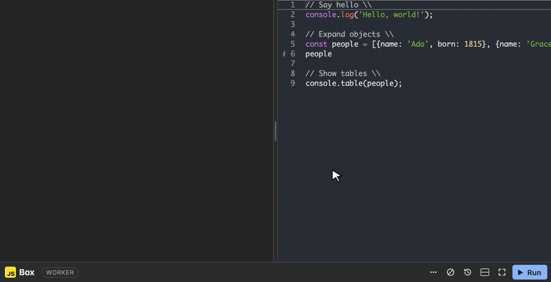

# YourJS Box

Embed an interactive JavaScript console on any web page with one script tag.
Step-by-step code blocks, DevTools-style output, and code that runs in a Web
Worker or the page itself.  TypeScript works too.

**[Live demo](https://westc.github.io/yourjs-box/)** &middot;
[Examples](https://westc.github.io/yourjs-box/#examples) &middot;
[Changelog](CHANGELOG.md)



## Usage

Add the script wherever you want the console to appear and put the code that
should be loaded into the console inside of the script tag:

```html
<div style="height: 400px;">
  <script src="https://cdn.jsdelivr.net/npm/yourjs-box@1/dist/yourjs-box.min.js">
    // Say hello \\
    console.log('Hello world!');

    // Show a table \\
    console.table([{name: 'John', age: 42}, {name: 'Jane', age: 37}]);
  </script>
</div>
```

The console fills its container (and is never less than 150px tall).  The
script is also available from unpkg at
`https://unpkg.com/yourjs-box@1/dist/yourjs-box.min.js`.

### Code Blocks

A comment line that ends with `\\` is a header.  Headers split the code into
blocks which are run one at a time each time the run button is clicked (or
<kbd>Ctrl</kbd>/<kbd>Cmd</kbd>+<kbd>Enter</kbd> is pressed in the editor).
<kbd>Ctrl</kbd>/<kbd>Cmd</kbd>+<kbd>Shift</kbd>+<kbd>Enter</kbd> (or **Run all
blocks** in the **&#8943;** menu) runs all of the remaining blocks, one after
another and in order with any hidden blocks.

Hovering over code that already ran shows a "Copy to editor" button which
copies that code into the editor so that it can be run again, as is or modified.
If the editor already has code in it you are asked before it is replaced.

### Toolbar

- The **&#8943;** button opens a menu (see below).
- **Clear** (or <kbd>Ctrl</kbd>+<kbd>L</kbd>) removes everything from the
  console.  Code can also call `console.clear()`.
- The **layout** button switches between showing the editor beside or below
  the console.
- **Full screen** shows the console using the whole screen.  If the browser
  doesn't allow that (eg. on an iPhone) the console fills the browser window
  instead.  Press <kbd>Esc</kbd> to exit.
- **Run** runs the next block of code.
- Clicking the **logo** opens the About window, which shows the version, this
  console's settings and keyboard shortcuts.
- **History** (or <kbd>Alt</kbd>/<kbd>&#8997;</kbd>+<kbd>H</kbd>) lists the code
  that was run so it can be put back into the editor.  Like the browser's
  console, pressing <kbd>&uarr;</kbd> when the cursor is at the very start of
  the editor (with nothing selected) shows the previous code that was run and
  <kbd>&darr;</kbd> at the very end goes forward again and eventually back to
  the code that hasn't been run yet.  After running code from the history, the
  code that hasn't been run yet comes back.  Hidden blocks aren't in the
  history.
- The **&#8943;** menu has:
  - **Run all blocks**, which runs all of the remaining blocks.
  - **Text size**, which is remembered for every console on the same site.
  - **Open**, which loads a JavaScript (or TypeScript) file as the code that the console starts
    with (its hidden blocks are hidden and Reset goes back to it).
  - **Save**, which saves the code that already ran and the code in the editor
    as a JavaScript (or TypeScript) file that can be opened later.
  - **Pop out into a window**, which moves the console into a separate window
    while the code keeps running in the page (so in window mode the code can
    still change the page).  Close the window or click **Bring it back** to
    move the console back into the page.
  - **Copy as HTML**, which gives you the HTML for this console (with its
    current code, its original code or no code) as an embed snippet or a full
    page that you can copy or download.  Only the `data-*` attributes that were
    set on the script tag are included.
  - **Reset**, which clears the console and puts the original code back into
    the editor.  In worker mode this also stops any code that is still running
    (eg. an infinite loop) by starting a new worker.
  - **About YourJS Box**

### Right-Clicking Values

Right-click any value in the output (including values inside of expanded
objects and arrays) for a menu with:

- **Copy as JSON** and **Save as JSON&hellip;**.  Maps and Sets become arrays
  and BigInts become strings.  Circular references (an object inside of itself)
  are left out and a message says how many were left out.
- **Store as global variable**, which stores the actual value (not a copy) as
  `temp1`, `temp2`, etc. so that later code can use it (in window mode it is
  stored on the page's `window`).
- **Copy property path** (for properties and array items), which copies the
  path from the logged value like `people[0].name`.
- **Refresh** (for objects, arrays, etc.), which shows the value as it is now
  if the code has changed it.  Anything that was expanded stays expanded.

### Attributes

| Attribute | Description |
| --- | --- |
| `data-block-type` | `"classic"` (default) runs each block like a regular `<script>` so top-level declarations are shared between blocks.  `"module"` runs each block like a `<script type="module">`.  See below. |
| `data-language` | `"javascript"` (default) or `"typescript"`.  See "TypeScript" below. |
| `data-show-results` | `"false"` stops the value of the last expression in each block from being shown. |
| `data-imports-url` | Where packages imported by name are loaded from.  See "Importing Packages" below. |
| `data-libraries-url` | Where to load Vue, Ace, Prism, Acorn and Babel from.  See "Self-Hosting the Libraries" below. |
| `data-runner` | `"worker"` (default) runs the code in a Web Worker.  `"window"` runs it directly in the page.  See below. |
| `data-divider-orient` | `"vertical"` puts the editor beside the output and `"horizontal"` puts it below.  If not specified the editor is beside the output unless the console is narrower than 600px. |
| `data-hide-empty-output` | `"true"` (default) only shows the editor until there is something in the output (eg. once code is run).  The output then stays (even after Clear) until the console is reset.  `"false"` always shows the output. |
| `data-hide-prefix` | Any block whose header starts with this prefix is hidden. See below. |
| `data-loading` | `"lazy"` (default) waits to load the console until it is about to be scrolled into view (or, if it is hidden, shown).  `"eager"` loads it right away.  See "Loading" below. |
| `data-rulers` | The columns where lines are shown in the editor, eg. `"80, 120"`.  Defaults to `"80"` and `""` shows none. |
| `data-theme` | `"light"` or `"dark"`.  Defaults to following the system's color scheme like the browser's dev tools. |
| `data-word-wrap` | `"true"` wraps long lines in the editor instead of scrolling sideways. |

### Results

Like the browser's console, if the last statement in a block is an expression
(eg. `2 + 2` or `numbers.map(n => n * 2)`) its value is shown after the block
runs, unless it is `undefined`.  Results aren't shown for hidden blocks.  Use
`data-show-results="false"` to turn this off.

### Module Blocks

By default each block runs like a regular `<script>`, so variables declared in
one block can be used in the next, but `await` can only be used inside of
`async` functions.  With `data-block-type="module"` each block runs like a
`<script type="module">` instead:

- Top-level `await` works.
- `import` works (eg. `import {camelCase} from 'lodash-es';`).
- Top-level declarations stay inside of their block, just like in a module.
  Use `globalThis` to share values between blocks.

### TypeScript

Add `data-language="typescript"` to write the code in TypeScript:

```html
<script src="https://cdn.jsdelivr.net/npm/yourjs-box@1/dist/yourjs-box.min.js" data-language="typescript">
  // Describe a person \\
  interface Person { name: string; born: number }
  const people: Person[] = [{name: 'Ada', born: 1815}, {name: 'Grace', born: 1906}];

  // Find the oldest \\
  function oldest<T extends Person>(list: T[]): T {
    return list.reduce((a, b) => a.born <= b.born ? a : b);
  }
  oldest(people)
</script>
```

Before each block runs, [Babel](https://babeljs.io/) removes the types, which
is how most TypeScript tools run code without a build step.  The types aren't
checked, so code with type errors still runs, just like it would in
JavaScript.  Enums, namespaces and parameter properties all work, and errors
point to the lines and columns in the TypeScript code.

TypeScript works with both block types.  Only type imports are removed (eg.
`import type {Options} from 'x'` or the `type Options` part of
`import {type Options, format} from 'x'`), so an import is never dropped just
because nothing uses it yet.  Babel is only downloaded by consoles that use
TypeScript.

### Importing Packages

npm packages can be imported by name.  They are loaded from
[esm.sh](https://esm.sh/), which turns npm packages into modules that work in
the browser:

```js
// In module blocks (data-block-type="module")
import _ from 'lodash';
import {format} from 'date-fns@4';

// In any block (including classic blocks), inside of async code
const {default: dayjs} = await import('dayjs');
```

Relative paths (eg. `./utils.js`), URLs (eg. `https://example.com/x.js`) and
`node:` imports are left alone.  Packages that need Node.js (eg. ones that use
`fs`) can't run in a browser.

To load packages from somewhere else set `data-imports-url` to a URL where
`{specifier}` is replaced with what was imported (eg. `lodash@4/fp`):

| Where | `data-imports-url` |
| --- | --- |
| esm.sh (the default) | `https://esm.sh/{specifier}` |
| jsDelivr | `https://cdn.jsdelivr.net/npm/{specifier}/+esm` |
| Turned off (only URLs and paths can be imported) | `""` |

### Self-Hosting the Libraries

The console's interface uses [Vue](https://vuejs.org/),
[Ace](https://ace.c9.io/), [Prism](https://prismjs.com/) and
[Acorn](https://github.com/acornjs/acorn) (plus
[Babel](https://babeljs.io/) for TypeScript), which are loaded from unpkg by
default.  Exact versions are always used so that a new release of one of them
can't change how the console works.

To load them from somewhere else (eg. your own site, an intranet or another
CDN) set `data-libraries-url` to a URL where `{name}` and `{version}` are
replaced with each library's package name and version.  Relative URLs are
relative to the page.

| Where | `data-libraries-url` |
| --- | --- |
| unpkg (the default) | `https://unpkg.com/{name}@{version}/` |
| jsDelivr | `https://cdn.jsdelivr.net/npm/{name}@{version}/` |
| Your own copy of `node_modules` | `/node_modules/{name}/` |

To host them yourself, install these exact versions and serve the whole
package folders (Ace and Prism load other files, such as language modes, from
next to their main files):

```bash
npm install vue@3.5.43 ace-builds@1.44.0 prismjs@1.30.0 prism-themes@1.9.0 acorn@8.18.0

# Only needed for TypeScript consoles
npm install @babel/standalone@7.29.9
```

The About window lists the versions that each version of YourJS Box uses.

### Console Functions

`console.log()`, `info()`, `warn()`, `error()`, `debug()`, `dir()`,
`dirxml()`, `table()`, `assert()`, `count()`, `countReset()`, `time()`,
`timeLog()`, `timeEnd()`, `trace()`, `group()`, `groupCollapsed()`,
`groupEnd()` and `clear()` are all shown in the console.

Like the browser's console, the first argument can use format specifiers:
`%s` (string), `%d` or `%i` (integer), `%f` (number), `%o` and `%O` (a value
that can be expanded), `%c` (CSS styles for the text after it) and `%%` (a
percent sign).  For example:

```js
console.log('%cHello%c, %s!', 'color: white; background: #1a73e8; padding: 2px 6px; border-radius: 4px', '', 'world');
```

Like the browser, `%c` only allows CSS for things like colors, fonts, borders,
margins and padding, and never anything that loads a URL.

A message that is the same as the one logged right before it is shown once with
a count instead of being repeated.  Messages that include objects are always
shown again since the objects may have changed.

### Loading

Like ``, a console isn't loaded until it is about to be
scrolled into view, so a page with many consoles (eg. a long tutorial) only
loads the ones that are read.  A console that is hidden (eg. in a closed tab)
loads once it is shown.  Its space in the page is kept while it waits, so
nothing moves around when it loads.

Until a console loads none of its code runs, including hidden blocks, and in
window mode the page's `console` functions aren't captured yet.  Add
`data-loading="eager"` to load a console right away (eg. if its hidden blocks
set up something that the page needs).

### Hidden Code

If `data-hide-prefix="HIDE"` is specified then a block with a header like
`// HIDE: Setup \\` will not be shown in the editor.  Instead it runs
automatically (once the console loads) as soon as all of the code that came
before it has run.  It shows up in the output as a collapsed block labelled
with whatever came after the prefix (and optional colon), or "Hidden code" if
nothing did.  Clicking the label shows or hides the code.

### JavaScript API

Loading the script also provides `YourJSBox` for creating consoles from
JavaScript (eg. in React, Vue or any page that adds content dynamically).  A
script tag in the `<head>` only provides the API, while one in the `<body>` is
also replaced by a console (with the code inside of it) as usual.

```html
<script src="https://cdn.jsdelivr.net/npm/yourjs-box@1/dist/yourjs-box.min.js"></script>
```

```js
const box = YourJSBox.create({
  target: '#lesson',
  code: "// Say hello \\\\\nconsole.log('Hello!');",
  theme: 'dark',
});

// Later (eg. when a component is removed):
box.destroy();
```

`YourJSBox.create(options)` returns `{element, destroy}` where `element` is the
console's IFRAME and `destroy()` removes it, stops its code and closes its
pop-out window (in window mode it also restores the page's `console`
functions).  The options are:

| Option | Description |
| --- | --- |
| `target` | Required.  The element (or a CSS selector for it) that the console is placed relative to. |
| `placement` | Where the console goes:  `"fill"` (default) replaces the target's contents, `"append"` and `"prepend"` add it inside of the target, `"replace"` replaces the target itself and `"before"` and `"after"` add it next to the target. |
| `height` | The CSS height of the console (a number is treated as pixels).  Defaults to `"100%"` so the console fills its container.  It is never less than 150px. |
| `code` | The code that the console starts with. |
| `runner`, `blockType`, `language`, `showResults`, `hidePrefix`, `hideEmptyOutput`, `dividerOrient`, `theme`, `wordWrap`, `rulers`, `importsUrl`, `librariesUrl`, `loading` | The same as the `data-*` attributes above.  `wordWrap`, `hideEmptyOutput` and `showResults` can be booleans and `rulers` can be an array (eg. `[80, 120]`). |

`YourJSBox.from(elements, options)` turns existing elements (eg. the code blocks
in a page made from Markdown) into consoles that start with their code:

```html
<script src="https://cdn.jsdelivr.net/npm/yourjs-box@1/dist/yourjs-box.min.js"></script>
<script>YourJSBox.from('pre > code.language-js');</script>
```

- `elements` is a CSS selector, an element or a list of elements (eg. an array
  or a `NodeList`).
- Each element's text is the console's code, so code that was already
  highlighted (eg. by Prism or highlight.js) works too.  A `<code>` that is the
  only thing in a `<pre>` is treated as the `<pre>`.
- `options` are the same as for `create()` (except `target` and `code`) and
  apply to every console.  `placement` defaults to `"replace"` and `height`
  defaults to a height that fits the code (from 250px to 600px).
- The `data-*` attributes of each element (or its `<pre>`) override the
  options for that console (eg. `data-theme="dark"` or `data-height="400"`)
  and a `language-ts` or `language-typescript` class turns on TypeScript.
- It returns an array with `{element, destroy}` for each console, in the same
  order as the elements.  Destroying a console that replaced its element puts
  the element back.

`YourJSBox.version` is the version of YourJS Box that was loaded.

### Where Code Runs

The console's interface is always in an IFRAME so that its styles and the
page's styles can't affect each other.  The code itself runs in one of two
places:

- **Web Worker** (`data-runner="worker"`, the default):  The code can't access
  the page.  There is no `document` or DOM, but everything else (timers,
  `fetch()`, promises, etc.) works.  Reset stops code that never finishes.
- **Window** (`data-runner="window"`):  The code runs directly in the page, so
  it can use the page's globals, functions and DOM.  Only use this with code you
  trust.  Since it replaces the page's `console` functions, the console also
  shows anything else the page logs, just like the browser's console.  Reset
  can't undo what the code already did to the page (eg. variables it defined).

In both modes, top-level declarations (`let`, `const`, `class`, etc.) are shared
between blocks.

## Development

Install the development dependencies by running `npm install`.

- `npm run dev` builds, rebuilds whenever one of the files in `src/` changes
  and serves the landing page and examples at http://localhost:3000/ (opening
  it in your default browser) with the browser reloading automatically after
  each rebuild.  Use `BROWSER=none npm run dev` to keep it from opening a browser.
- `npm run build` builds the files in `dist/` once.
- `npm test` builds and then runs the browser tests in `test/run.js` using your
  installed copy of Google Chrome (set `CHROME_PATH` to use another Chromium
  based browser).  An internet connection is needed because the console loads
  its libraries from CDNs.  Pass part of a test's name to run only matching
  tests (eg. `node test/run.js module`).
- Before releasing, move the notes under **Unreleased** in
  [CHANGELOG.md](CHANGELOG.md) into a section for the new version.
- `npm run release -- <patch|minor|major>` releases a new version:  it checks
  that you're on an up to date, clean `main`, runs the tests, runs
  `npm version`, pushes `main` and then the tag (separately, because GitHub
  Pages doesn't always deploy when they are pushed together), publishes to npm
  and, once npm lists the new version, purges jsDelivr's cache.  Add
  `--dry-run` to see what it would do or `--skip-tests` to skip the tests.
- `npm run record-demo` records `demo.gif` (shown at the top of this README)
  from the built files.  It needs [ffmpeg](https://ffmpeg.org/).
- `npm run og-image` makes `og-image.png` (the picture shown when the landing
  page is shared) from the built files.
- `npm run purge-cdn` purges jsDelivr's cache so that URLs like
  `yourjs-box@1` point to the latest version right away.
- In VS Code, **Terminal &rarr; Run Task&hellip;** has tasks for all of these
  (eg. Build, Dev server, Test, Release&hellip; and Redeploy GitHub Pages).
- `npm start` builds and then rebuilds whenever one of the files in `src/`
  changes (without serving anything).

The kitchen sink example (`examples/kitchen-sink.html`) has a sidebar for
choosing an example and every option, including which build is loaded
(`dist/yourjs-box.full.js`, `dist/yourjs-box.js` or `dist/yourjs-box.min.js`).
The options are kept in the URL so the page can be reloaded or shared as is.

## Roadmap

Ideas for future versions, roughly from easiest to hardest:

- **Smaller Acorn:** Acorn's package only has an unminified build (about 60 KB
  compressed).  A minified copy is about 35 KB (jsDelivr makes one
  automatically, but unpkg and self-hosted copies don't), so Acorn could be
  loaded from jsDelivr by default or a minified copy could be published with
  this package.
- **`data-autorun`:** run every visible block when the page loads.
- **Autocomplete:** turn on Ace's keyword and snippet completion in the editor.
- **`data-remember`:** save the editor's code and history in the browser so
  that they are still there after a reload.
- **Copy output:** copy everything in the console as text from the **&#8943;**
  menu.
- **Clickable error locations:** clicking `snippet-2.js:3:7` in an error
  highlights that line in the code that ran.
- **More JavaScript API:** `box.run()`, `box.runAll()`, `box.reset()`,
  `box.setCode()` and events (eg. `box.on('log', ...)`) so that a page can
  control the console.
- **Output filter:** search the output and show only errors, warnings or logs.
- **Exercises:** hidden blocks that check the code above them and show which
  checks passed (eg. "`sum(2, 3)` should be `5`").
- **`@timeout`:** an annotation in a block's header that runs the block
  automatically once nothing has been logged for the given number of seconds.
- **Long output:** keep the console fast when thousands of messages are logged.
- **Accessibility:** announce new output to screen readers and make every value
  and menu reachable with the keyboard.

## License

Released under the [MIT License](LICENSE).  You're free to use, modify and
distribute it, including in commercial projects, as long as the copyright and
license notice is kept.

Copyright (c) 2023-present Chris West
